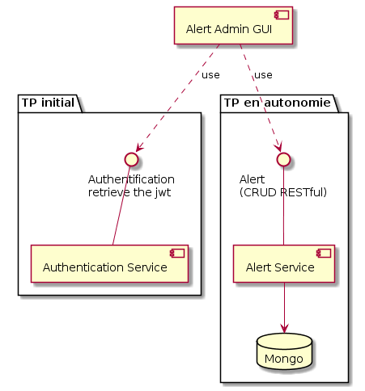

[](https://snyk.io/test/github/stfanmichel/ESIR-TP5-SUBJECT?targetFile=package.json)

# ESIR-TP5 - Authentification

Nous démarrons avec ce TP un projet un peu plus conséquent qui vous occupera durant 4 TP.

Les 3 prochains TP seront fait avec Benoît Chanclou.

Le schéma d'architecture global est disponible 

Aujourd'hui nous nous occuperons uniquement de la brique 'TP Initial'.

## Evaluation

Le TP complet donnera lieu à une note. Vous fournirez pour cela un accès à votre repository GIT aux correcteurs (moi même et Benoît Chanclou). Afin que votre travail puisse être évaluer correctement, pensez à tagger vos commit régulièrement dans le temps.
Parmis les critères d'évaluation on trouvera (liste non exhaustive, mais l'essentiel y est) :

- l'atteinte de l'objectif (c'est quand même mieux si vous arrivez au bout),
- les performances (tests de monté en charge),
- la qualité du code (lisibilité, formatage, commentaires, testabilité, organisation des sources, etc.),
- les tests unitaires (c'est mieux si ils passent et bien sur la couverture de code),
- l'historique GIT (commentaires, propreté, cohérence...)

## Objectifs :

Nous nous occuperons pendant cette scéance de réaliser un serveur d'authentification qui vous servira pour la suite du projet.

Nous allons partir du code déjà réalisé lors du TP4 et d'une spécification d'API REST au format Swagger que nous allons implémenter.

[OpenAPI authentication API](Swagger_Authentication_API.yaml)

**Pour visualiser correctement ce fichier, sous VSC utilisez le plugin ["OpenAPI Preview" de Andreas Zoallner](https://marketplace.visualstudio.com/items?itemName=zoellner.openapi-preview) plutôt que le plugin swagger qui gère asser mal l'OpenAPI v3.0.**

De plus, pour changer un peu les habitudes nous allons commencer par réaliser les tests unitaires à la mode TDD.

## Sujets abordés :

- Express
- REST / CRUD
- Tests unitaires
- Code coverage
- JWT
- Swagger / OpenAPI 3.0

## Lien utiles :

- Outillage (npm, node, git, curl, postman, ab, etc.) : https://slides.com/stephmichel/deck-4#/
- Express : Le cours sur les tests unitaires et de charges de Benoît.
- tests unitaires avec mocha et chai : https://mherman.org/blog/testing-node-js-with-mocha-and-chai/
- Site de validation de jeton JWT : https://jwt.io/

## Modules node utilisés

- express : https://www.npmjs.com/package/express
- mocha : https://www.npmjs.com/package/mocha
- chai : https://www.npmjs.com/package/chai
- chai-http : https://www.npmjs.com/package/chai-http
- nyc : https://www.npmjs.com/package/nyc
- tcomp : https://www.npmjs.com/package/tcomb
- helmet : https://www.npmjs.com/package/helmet
- jsonwebtoken : https://www.npmjs.com/package/jsonwebtoken
- uuid : https://www.npmjs.com/package/uuid
- bcrypt : https://www.npmjs.com/package/bcrypt
  Et n'importe quel autre module node qu'il vous semblera utile.

Pour le bon déroulement du TP et pour vous familiariser avec GIT, lorsque vous liser une ligne du genre (tag: BLA-BLA-BLA),
c'est qu'il est temps de commiter vos modifications afin de pouvoir revenir à ce niveau de code plus tard si besoin.

# Initialisation d'un projet

Nous allons repartir du TP4 que nous allons étendre.

Notez quelques ajouts tout de même :

- l'utilisation du module _tcomb_ pour définir et valider la strcture d'un USER proprement (utilisé dans la méthode validate() de model/users.js).
- l'utilisation du module _nyc_ (anciennement Istanbul), pour faire du code coverage.
- l'ajout des scripts suivants dans package.json
  - _"test": "mocha --timeout 10000 --exit"_ : pour lancer les tests une fois. Commande **npm test**.
  - _"test-watch": "mocha --watch"_ : pour lancer les tests en tâche de fond, ils sont relancés dès que le code est modifié dans le projet. Commande **npm run test-watch**.
  - _"test-coverage": "nyc --reporter=lcov --reporter=text-lcov npm test"_ : pour lancer les tests et le calcul du code coverage des tests. Commande **npm run test-coverage**.
  - _"test-report": "npm run test-coverage && nyc report"_ : Pour lancer les tests, le calcul du code coverage et la génération du rapport au format HTML dans ./coverage/lcov-report/ESIR-TP5-SUBJECT/index.html. Commande **npm run test-report**.

Notez que pour le moment l'ensemble des tests passent et que la couverture de code est de 100% (à une vache prêt).

**Il est bien évidemment souhaitable qu'au fil du temps ses statistiques ne se dégradent pas, ce sera pris en compte dans l'évaluation du TP**...

```
npm run test-report

-------------------------|----------|----------|----------|----------|-------------------|
File                     |  % Stmts | % Branch |  % Funcs |  % Lines | Uncovered Line #s |
-------------------------|----------|----------|----------|----------|-------------------|
All files                |      100 |      100 |      100 |      100 |                   |
 ESIR-TP5-SUBJECT        |      100 |      100 |      100 |      100 |                   |
  app.js                 |      100 |      100 |      100 |      100 |                   |
 ESIR-TP5-SUBJECT/model  |      100 |      100 |      100 |      100 |                   |
  users.js               |      100 |      100 |      100 |      100 |                   |
 ESIR-TP5-SUBJECT/routes |      100 |      100 |      100 |      100 |                   |
  users-v1.js            |      100 |      100 |      100 |      100 |                   |
-------------------------|----------|----------|----------|----------|-------------------|
```

(tag : **TP5-ESIR-INIT**)

# Step 1 - TDD : tests unitaires de l'API

Réaliser les tests unitaires de l'API d'authentification spécifiées par le swagger ci-dessus. Une partie a déjà été réalisée lors du TP4, mais doit être modifiée afin d'ajouter la notion de mot de passe. Il doit être possible de créer (dans la méthode POST) et modifier (dans la méthode PATCH) le mot de passe d'un utilisateur.

Lancer en tâche de fond (avec mocha --watch) les tests unitaires (qui pour le moment doivent échouer puisque le modèle et la route n'a pas encore été modifiée).

(tag : **TP5-ESIR-STEP1**)

# Step 2 - modèle de données

Avant de réaliser les services web de l'API, nous allons devoir étendre le code du modèle de données du TP4 afin d'ajouter le notion de mot de passe utilisateur.
**Attention : Le mot de passe ne devra pas être stocké en clair !**

Pour cela on stockera le hashcode (avec un peu de sel) du mot de passe et pas sa valeur. Ceci est une bonne pratique très importante (même si dans notre cas trivial de stockage en dur dans le code cela a peu d'intérêt) ! **N'importe quel responsable sécurité vous en voudrait beaucoup de ne pas le faire.**

Le module bcrypt (https://www.npmjs.com/package/bcrypt) dispose de tout ce qu'il faut pour y arriver.

## Remarque sur le sel

Le sel est une chaîne de caractère qui est ajoutée au mot de passe dont on souhaite calculer le hash. Les mots de passes étant souvent relativement cours (quelques caractères), ajouter du sel pour calculer le hash complique considérablement toute tentative de "dehashage" par des méthodes de "force brute". Bien entendu le sel doit être stocké dans un coin si possible pas trop visible et rester côté serveur.

(tag : **TP5-ESIR-STEP2**)

# Step 3 - implémentation de l'API

Implémenter les deux méthodes de l'API auth (/v1/auth/login et /V1/auth/verifyaccess) dans un router spécifique (/routes/auth-v1.js par exemple) pour la partie REST et dans /model/idp.js (par exemple) pour le code métier associé.

Pour la génération du jeton JWT on utilisera le module jsonwebtoken (https://www.npmjs.com/package/jsonwebtoken).

Vérifier que les tests unitaires passent maintenant.

(tag : **TP5-ESIR-STEP3**)

## La même avec des appels asynchrones (si ce n'est pas déjà fait)

Les modules bsync et jsonwebtoken disposent d'API asynchrone, autant les utiliser.
L'objectif est de remplacer les appels :

    - bcrypt.hashSync par bcrypt.hash

    - bcrypt.compareSync par bcrypt.compare

    - jwt.verify(token, secret) par jwt.verify(token,secret,callback)

    - jwt.sign(object, secret) par jwt.sign(object, secret,callback)

Il se peut que des erreurs de link apparaissent avec le module bsync suivant les plateformes. Dans ce cas il peut être nécessaire de recompiler le module ainsi :

      npm rebuild bcrypt --build-from-source

Si cela ne fonctionne toujours pas il sera nécessaire d'utiliser le module bcryptjs (https://www.npmjs.com/package/bcryptjs), moins performant mais pure javascript.

(tag : **TP5-ESIR-STEP3-BONUS-ASYNC**)

# Step 4 - sécurisation des services web

Maintenant que l'on dispose d'une API d'authentification il va falloir l'utiliser...
L'objectif ici est de sécuriser tous les appels de WS de (users et de auth) afin de n'autoriser leur accès que si un jeton JWT est présent dans le header (authorization: bearer mon.jeton.jwt).
La seule méthode qui ne devra pas être sécurisée est la méthode d'authentification (/v1/auth/login) sinon forcement, ça va pas le faire...

Bien entendu on évitera d'ajouter un traitement dans chaque service REST mais on développpera un middleware que l'on utilisera avec le app.use d'express pour le faire de manière propre et globale.

Pour tester votre code (en plus des tests unitaires), utilisez curl (https://slides.com/stephmichel/deck-4#/7/1) ou postman (https://slides.com/stephmichel/deck-4#/9).

Vous réaliserer un premier appel en POST au service /v1/auth/login afin de récupérer un jeton. Si vous êtes curieux, vous pouvez analyser le contenu de ce jeton (https://slides.com/stephmichel/http#/18/4).

Vous pourrez alors appeler les autres méthodes de l'API en renseignant le champ Authorization dans le header (https://slides.com/stephmichel/http#/18/6).

(tag : **TP5-ESIR-STEP4**)
